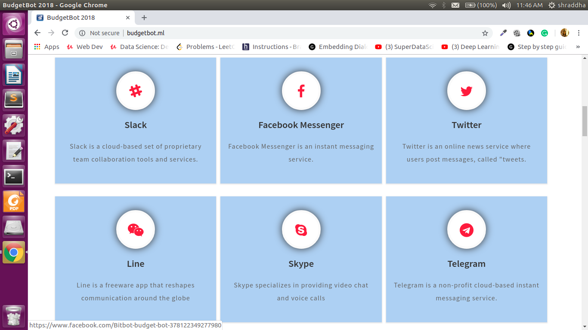
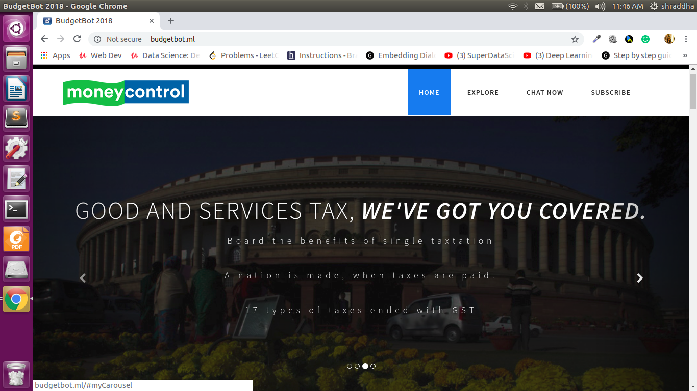
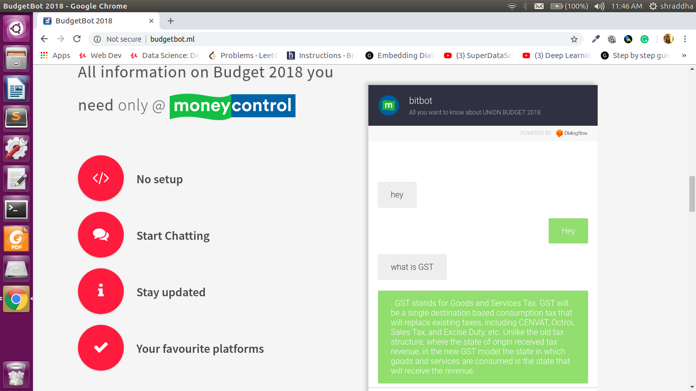
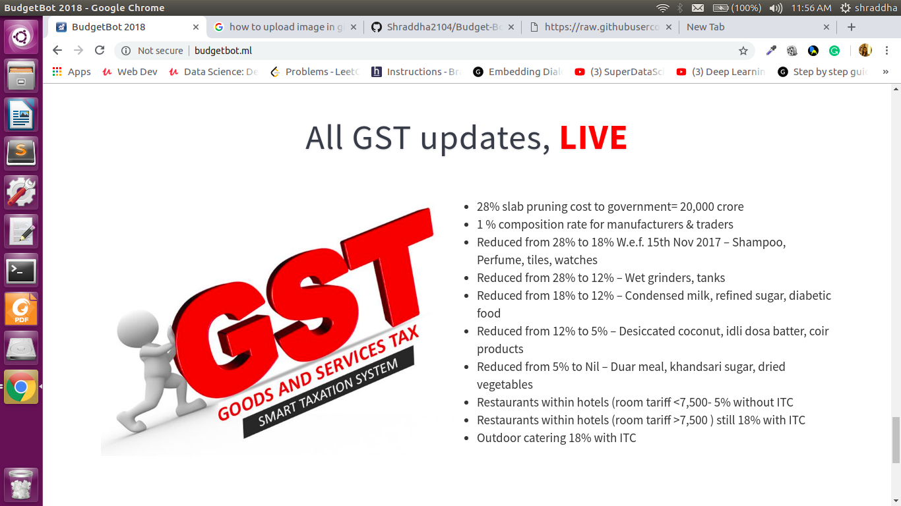

# Budget-Bot
> It was developed at the Money-control Hackabot Challenge(BKC-Mumbai).
> We stood in top 10 amongst all the teams.

## Features

* Hosted on budgetbot.ml
* Built a interactive bot that simplifies the budget for consumers by answering queries posted by users in natural English language.
* Entity extraction using NLP
* Bot answers from the knowledge base repository of 600+ articles prepared by the moneycontrol editorial team.

## Screenshots

### Integration with different social media platforms

### Features

### Budget-Bot 

### Live news update

